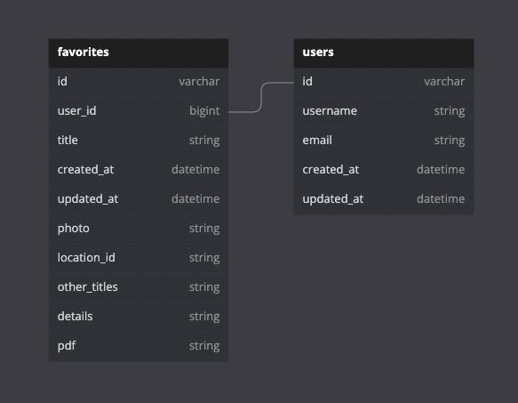

# HISTORY MAPS

  
<br>

<!-- TABLE OF CONTENTS -->
<details>
  <summary>Table of Contents</summary>
  <ol>
    <li>
      <a href="#about-our-project">About Our Project</a>
      <ul>
        <li><a href="#built-with">Built With</a></li>
        <li><a href="#tested-with">Tested With</a></li>
      </ul>
    </li>
    <li>
      <a href="#how-to-access-our-history-maps-api">How to Access Our History Maps API</a>
      <ul>
        <li><a href="#endpoints-available">Endpoints Available</a></li>
        <li><a href="#repo-and-heroku-sites">Repo and Heroku Sites</a></li>
        <li><a href="#backend-schema">Backend Schema</a></li>
      </ul>
    </li>
    <li><a href="#contributors">Contributors</a></li>
  </ol>  
</details>

<!-- ABOUT OUR PROJECT -->
### About our Project
---
```
History Maps is a backend Ruby on Rails project that calls multiple API's in order to provide a JSON package for our History Maps FE to consume.  

The purpose of this project is to build an efficient API to streamline our Frontends consumption of information.  

We have many great thoughts for our project, but if you would like to contribute, feel free to reach out to any of the contributors on GitHub! Find our contact information below!!
```
<br>

### Built With

  * [Rails v5.2.8](https://rubyonrails.org/)
  * [Ruby v2.7.4](https://www.ruby-lang.org/en/)

### Tested With

* [RSpec v3.11](https://rspec.info/)
* [PostMan](https://www.postman.com/)

<p align="right">(<a href="#top">back to top</a>)</p>

<!-- HOW TO ACCESS OUR HISTORY MAPS API -->
### How to access our History Maps API
---
```
If you have experience with consuming APIs, please see then endpoints below and feel free to experiment with everything we provide!  

If you are new to APIs, the endpoints provided below will return JSON information for you to use on your website. By getting familiar with how API information is packaged, you will find multitudes of information to consume! ENJOY!!!!
```  
<br>

### Endpoints Available
---

GET ```'/api/v1/users'```  
- Routes to users#index

GET ```'/api/v1/users/:id'```  
- Routes to users#show

POST ```'/api/v1/users/register'```  
- Routes to users#create  

GET ```'/api/v1/users/:id/favorites'```  
- Routes to favorites#index

POST ```'/api/v1/users/:id/favorites'```  
- Routes to favorites#create

GET ```'/api/v1/search'```  
- Routes to location_search#show
  * params: `location`

GET ```'/api/v1/results'```
- Routes to results#index

GET ```'/api/v1/results/:id'```
- Routes to results#show

<br>

<p align="right">(<a href="#top">back to top</a>)</p>

### Repo and Heroku Sites
---
__Backend__

- https://github.com/enalihai/history_maps_be

- https://history-maps-be.herokuapp.com/

__Frontend__

- https://github.com/clayash/history_maps_FE

- https://find-history-maps.herokuapp.com/  
<br>

### Backend Schema
---
  

__Tables__  

    - Users
        has_many: favorites

    - Favorites
        belongs_to: user

<br>
<p align="right">(<a href="#top">back to top</a>)</p>

<!-- CONTRIBUTORS -->
### Contributors
---
Zac Hazelwood  
GitHub: [@ZacHazelwood](https://github.com/ZacHazelwood)  
  

Oscar Santos  
GitHub: [@Oscar-Santos](https://github.com/Oscar-Santos)   
  

Luke Pascale  
GitHub: [@enalihai](https://github.com/enalihai)  
  

Clay Ash  
GitHub: [@ClayAsh](https://github.com/ClayAsh)  
  

Matthew Deming  
GitHub: [@Deming-Matt](https://github.com/Deming-Matt)  
  

Colin Reinhart  
GitHub: [@ColinReinhart](https://github.com/ColinReinhart)    


<br>
<p align="right">(<a href="#top">back to top</a>)</p>
